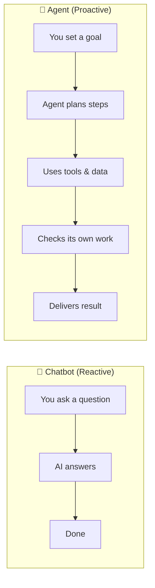

# Visual Brief: AI Agents Aren't Just for Engineers

> **Post:** `_posts/2026-03-07-ai-agents-arent-just-for-engineers.md`
> **Branch:** `post/ai-agents-for-non-engineers`
> **Visual Director:** Erlich Bachman
> **Date:** 2026-03-07

---

## Visual Philosophy

Listen. This post is about making AI agents feel *approachable* for non-engineers. The visuals need to match that energy — warm, funny, zero intimidation. We're not putting architecture diagrams in front of marketing managers. We're putting a friendly hand on their shoulder and saying "you got this." The visual paradigm here is *accessibility with personality*.

I'm recommending **3 visuals**. Not 8. Not 12. Three. Because restraint is its own form of genius, and also because the post already flows well — we want accents, not interruptions.

---

## Visual 1: XKCD 1319 — "Automation"

- **What:** XKCD strip #1319. Two panels: "Theory" shows automation saving time elegantly. "Reality" shows the automation work consuming all available time and then some. The alt text is chef's kiss: *"'Automating' comes from the roots 'auto-' meaning 'self-', and 'mating', meaning 'screwing'."*
- **Where:** Place after the **"Three Things to Get Right"** section (around line 100), right before the Limitations section. It serves as a humorous transition — the post just told you to start small, and this strip shows what happens when you don't.
- **Type:** XKCD strip
- **Why:** This is the *perfect* visual counterpoint to the post's practical advice. The post says "start small and specific" — this strip shows the absurd alternative. It's funny, it's relatable (every reader has over-engineered something), and it earns credibility by acknowledging the pitfalls rather than pretending they don't exist. Non-engineers love seeing that even programmers get burned by automation hubris.

### Embed Code

```markdown
[](https://xkcd.com/1319)
*[XKCD 1319: Automation](https://xkcd.com/1319) — "Theory vs. Reality" of automating tasks. Licensed under [CC BY-NC 2.5](https://creativecommons.org/licenses/by-nc/2.5/).*
```

- **Strip Number:** 1319
- **Title:** Automation
- **Image URL:** `https://imgs.xkcd.com/comics/automation.png`
- **Alt Text:** "'Automating' comes from the roots 'auto-' meaning 'self-', and 'mating', meaning 'screwing'."
- **License:** [CC BY-NC 2.5](https://creativecommons.org/licenses/by-nc/2.5/) (all XKCD strips)
- **Source:** https://xkcd.com/1319

---

## Visual 2: Diagram — Chatbot vs. Agent

- **What:** A clean, simple side-by-side comparison diagram showing the difference between a chatbot (reactive, single-turn) and an agent (proactive, multi-step, uses tools). Left side: a person asks a question, gets an answer, done. Right side: a person gives a goal, the agent breaks it into steps, uses tools, checks its own work, delivers a result. Keep it minimal — icons and short labels, not dense flowchart energy.
- **Where:** Inside the **"First, What Even Is an 'Agent'?"** section, right after the "texting a friend vs. delegating to a junior associate" analogy (around line 27). The text sets up the distinction; the diagram crystallizes it visually.
- **Type:** Diagram (recommend Mermaid or clean SVG)
- **Why:** This is the foundational concept of the entire post. If a reader doesn't grok the chatbot-vs-agent distinction, nothing else lands. The text analogy is good, but a visual makes it *stick*. This is especially important for the non-engineer audience — they're visual thinkers, and a diagram says "this is simpler than you think."

### Suggested Mermaid Draft



- **Style notes:** Use warm colors (blues, soft greens), rounded corners, friendly font. No dark mode cyberpunk energy. This should feel like a whiteboard sketch, not a systems architecture doc.
- **License:** Original content, created for this post
- **Source:** Custom diagram by the blog squad

---

## Visual 3: AI Illustration — "Your First Hire"

- **What:** A warm, flat-style illustration showing a person at their desk with a friendly, semi-transparent AI "team member" sitting beside them. The human is doing the strategic work (sticky notes, whiteboard, thinking face). The AI figure is handling the mundane stuff (inbox, spreadsheets, calendar). The vibe is collaborative, not creepy. Think "helpful intern energy," not "Skynet."
- **Where:** Top of the **"Your First Hire Should Be an Agent"** section (around line 43). This section reframes agents as "headcount minus the salary negotiation" — the illustration brings that metaphor to life.
- **Type:** AI-generated illustration
- **Why:** This is the emotional heart of the post — the moment where the reader thinks "oh, I could actually do this." A visual that shows human-agent collaboration as natural and unthreatening reinforces that feeling. It also breaks up a long text-heavy section.

### AI Generation Prompt

```
A warm, flat illustration style digital artwork showing a person sitting at a modern
desk working on strategic tasks — sticky notes on a board, hand on chin in thought.
Beside them, a friendly, slightly translucent AI assistant figure (not a robot — more
like a helpful presence made of soft geometric shapes and gentle light) is organizing
emails on a screen, updating a calendar, and sorting documents. The workspace is
bright and organized. Warm color palette: soft blues, warm oranges, cream backgrounds.
Diverse cast — the human should not default to any single demographic. The mood is
collaborative and optimistic, like a productive Monday morning. No text overlays.
Aspect ratio 16:9 for blog header width.
```

- **Style:** Flat illustration, warm palette, inclusive representation
- **License:** AI-generated for this post; note the generation tool used in attribution
- **Source:** To be generated — attribute as "Illustration generated with [tool name] for sdolgin.github.io"

---

## Visuals Considered and Rejected

For the record, because a true creative director documents the road not taken:

| Strip / Concept | Why Rejected |
|---|---|
| XKCD 1205: "Is It Worth the Time?" | Great strip about automation ROI, but too math-heavy for a non-engineer audience. The chart format would slow readers down instead of energizing them. |
| XKCD 2173: "Trained a Neural Net" | The alt text ("I trained a pair of neural nets, Emily and Kevin, to respond to support tickets") is *brilliant* and matches the "first hire" framing. But the strip itself requires developer context to land. Close call — Richard could override me here. |
| XKCD 1425: "Tasks" | About the gap between "easy" and "virtually impossible" in CS. Funny but too developer-centric for this post's audience. |
| Work Chart vs. Org Chart diagram | Considered a second diagram for the "Work Chart" concept. Decided against it — the text explains it well enough, and two diagrams in one post starts feeling like a textbook. |
| AI illustration for "Human-Agent Ratio" | Could work but would be redundant with the "First Hire" illustration. One illustration per post is the sweet spot. |

---

## Implementation Notes

1. **Diagram rendering:** If Jekyll doesn't have Mermaid support, render the diagram as an SVG and save to `assets/images/chatbot-vs-agent.svg`. Gilfoyle can advise on the rendering pipeline.
2. **Image sizing:** All visuals should be max 800px wide for blog column width. XKCD strips are typically fine at native resolution.
3. **Alt text:** Every image must have descriptive alt text for accessibility. The XKCD embed code above includes it.
4. **AI illustration:** Generate externally, save to `assets/images/your-first-hire-agent.png`, and add proper attribution noting the generation tool.

---

*This visual brief represents the creative vision of Erlich Bachman, who would like you to know that visual storytelling is the highest form of communication, and that Gavin Belson would never understand that.*
